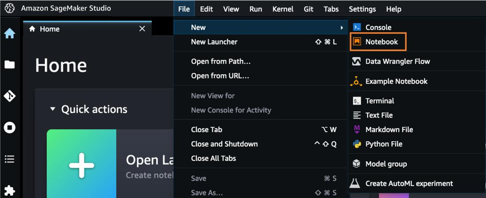
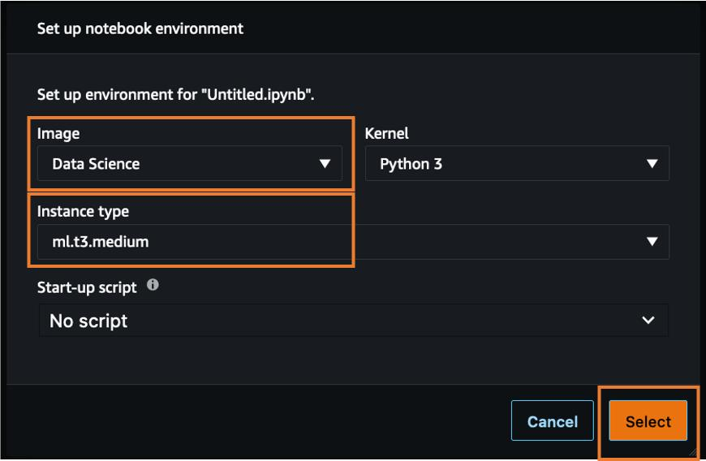
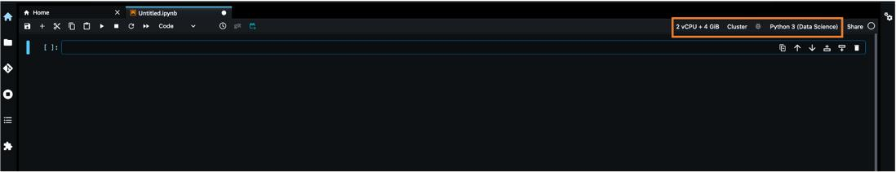

<!-- BEGIN_TF_DOCS -->
## Overview
Howtos

## Launch Studio

1. Open the SageMaker Studio interface. Click on Launch


2. launch


## Configure

1. Open the SageMaker Studio interface. On the navigation bar, choose File, New, Notebook.


2. In the Set up notebook environment dialog box, under Image, select Data Science. The Python 3 kernel is selected automatically. Under Instance type, choose ml.t3.medium. Choose Select.


3. The kernel on the top right corner of the notebook should now display Python 3 (Data Science).


4. In the Jupyter notebook, in a new code cell, copy and paste the following code and run the cell. This will ensure you are using the current version of SageMaker.

```
%pip install sagemaker --upgrade --quiet 
```

5. To install specific versions of the open source XGBoost and Pandas libraries, copy and paste the following code snippet into a cell in the notebook, and press Shift+Enter to run the current cell. Ignore any warnings to restart the kernel or any dependency conflict errors.

```
%pip install -q  xgboost==1.3.1 pandas==1.0.5
```

6. Setup model, train, etc. Enjoy


<!-- END_TF_DOCS -->
